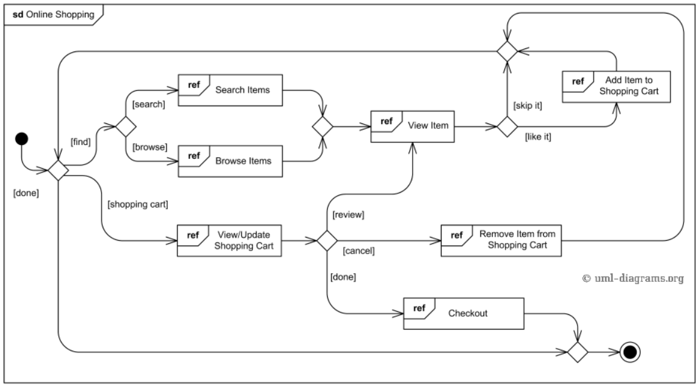

# Testovací scénáře

## Zadání
Vytvořte testovací scénáře k přiloženému diagramu.

Pro tvorbu scénářů využijte libovolný nástroj. Chybějící parametry si můžete definovat vlastní. Důležitým výstupem není pokrytí všech scénářů, ale co všechno má scénář obsahovat a jaké typy scénářů je potřeba vytvořit (doporučujeme slovní dodatek).

## Zpracování
Jednotlivé testovací případy a jejich kroky jsou popsány v souborech složky [features](features). Použila jsem gherkin syntaxi, aby byly srozumitelné pro všechny stakeholdery projektu a zároveň umožnily jednoduchou implementaci automatizace přidáním step definition souborů.

Pre-conditions testu jsou popsány kroky **Given**

Akce testu jsou popsány kroky **When**

Post-conditions testu jsou popsány kroky **Then**

Vzhledem k nízkému počtu případů jsem testovací data uvedla přímo u nich.

Všechny scénáře vycházi z předpokladu, že testovací prostředí je funkční, připraveno k testům a obsahuje produkty zmiňované v jednotlivých případech.

### Scénář 1

 1. Vyhledání produktu (@search)
 2. Zobrazení detailů produktu (@view)
 3. Přidání produktu do košíku (@like_it)
 4. Návrat na výchozí stránku (@skip_it)
 5. Procházení produktů dle kategorie (@browse)
 6. Přidání produktu do košíku (@like_it)
 7. Zobrazení košíku (@shopping_cart)
 8. Kontrola produktu (@review)
 9. Návrat do košíku (@shopping cart)
 10. Změna množství produktu v košíku (@update)
 11. Odebrání produktu z košíku (@cancel)
 12. Dokončení objednávky (@done)

Pokryté případy:
 - Scenario: Searching for a specific item
 - Scenario: Viewing product details
 - Scenario: Adding items to the shopping cart
 - Scenario: Returning to the homepage
 - Scenario: Browsing items by category
 - Scenario: View items in the shopping cart
 - Scenario: Viewing product details from the shopping cart
 - Scenario: Update the quantity of items in the shopping cart
 - Scenario: Remove items from the shopping cart
 - Scenario: Proceeding to checkout from the shopping cart
